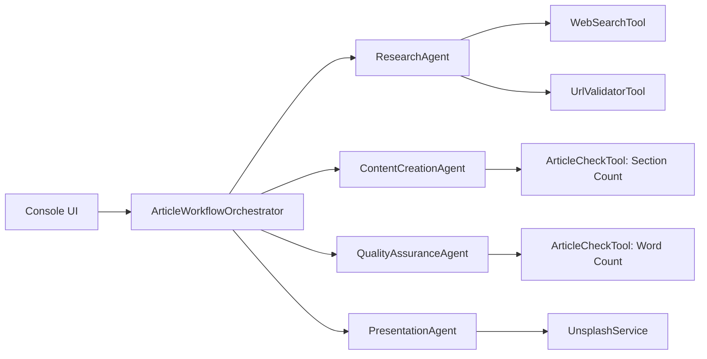
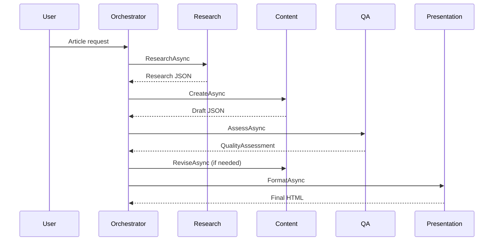

# AI Article Writer - Session Slide Deck Outline

## How To Use This Document

This is a ready-to-present slide script.
For each slide:

1. Use the Slide Title as the heading.
2. Copy the Slide Content bullets into your slide.
3. Use the Speaker Notes while presenting.

---

## Slide 1 - Title

### Slide Content

- AI Article Writer
- Multi-Agent Content Pipeline on .NET 8 + Azure OpenAI
- Research -> Draft -> QA -> HTML Presentation

### Speaker Notes

- Introduce this as a practical agentic system, not just a chat app.
- Explain that the system transforms a user topic into a publishable HTML article.
- Set expectation: architecture, internals, and live execution flow.

---

## Slide 2 - Problem Statement

### Slide Content

- High-quality long-form content is hard to automate
- Common issues:
  - weak sourcing
  - inconsistent structure
  - low factual confidence
  - poor final presentation quality
- Need: quality-controlled, observable generation pipeline

### Speaker Notes

- Position the problem in engineering terms: reliability and repeatability.
- Emphasize that one monolithic prompt usually fails to guarantee quality and structure.

---

## Slide 3 - Solution Summary

### Slide Content

- 4 specialized agents coordinated by an orchestrator
- Tool-assisted research and validation
- QA gating with revision loop
- Deterministic C# renderer for final HTML output

### Speaker Notes

- Stress separation of concerns: each agent has one clear responsibility.
- Mention that final rendering is not LLM-generated markup.

---

## Slide 4 - Architecture Overview

### Slide Content

- Core components:
  - Console UI
  - ArticleWorkflowOrchestrator
  - ResearchAgent
  - ContentCreationAgent
  - QualityAssuranceAgent
  - PresentationAgent

- External integrations:
  - Azure OpenAI
  - Serper Search API
  - Unsplash API

### Speaker Notes

- Explain that orchestration is deterministic while generation and evaluation are model-driven.
- Highlight that tools are explicit and observable.

### Diagram (Mermaid)



### Diagram (ASCII fallback)

```text
Console UI -> Orchestrator
  -> ResearchAgent -> WebSearchTool/UrlValidatorTool
  -> ContentCreationAgent -> ArticleCheckTool (section count)
  -> QualityAssuranceAgent -> ArticleCheckTool (word count)
  -> PresentationAgent -> UnsplashService
```

---

## Slide 5 - End-to-End Runtime Flow

### Slide Content

- User provides topic, audience, tone, length
- Orchestrator runs:
  1. Research
  2. Draft creation
  3. QA + revision loop
  4. HTML rendering
- Output: structured JSON + publishable HTML

### Speaker Notes

- Mention that revision loop stops on QA decision or max revision cap.

### Diagram (Mermaid)



---

## Slide 6 - Data Contracts (DTOs)

### Slide Content

- `ArticleRequest`
  - Topic, audience, tone, key points, length tier
- `QualityAssessment`
  - scores, `requiresRevision`, `revisionSuggestions`, `weakSectionIndices`
- `ArticleWorkflowResult`
  - final JSON, HTML, score, revision count

### Speaker Notes

- Explain why explicit contracts improve maintainability and testability.

### Reference Snippet

Reference: `Models/ArticleModels.cs`

```csharp
public record QualityAssessment(
    [property: JsonPropertyName("overallScore")] double OverallScore,
    [property: JsonPropertyName("requiresRevision")] bool RequiresRevision,
    [property: JsonPropertyName("revisionSuggestions")] string[] RevisionSuggestions,
    [property: JsonPropertyName("weakSectionIndices")] int[]? WeakSectionIndices = null
);
```

---

## Slide 7 - Research Agent

### Slide Content

- Generates search query set
- Runs search fan-out in parallel
- Synthesizes structured research package
- Validates URLs before citation

### Speaker Notes

- Point out the optimization: parallelized search is a major latency reduction.

### Reference Snippet

Reference: `Agents/ResearchAgent.cs`

```csharp
var searchTasks = queries
    .Select(q => _webSearch.SearchWebAsync(q))
    .ToList();

string[] searchResults = await Task.WhenAll(searchTasks);
```

---

## Slide 8 - Content Creation Agent

### Slide Content

- Produces strict JSON article schema
- Enforces one section per key point
- Preserves localization labels
- Supports targeted revisions by section index

### Speaker Notes

- Explain that targeted revisions reduce token cost and latency.
- Mention fallback to full revision when targeted extraction fails.

### Reference Snippet

Reference: `Agents/ContentCreationAgent.cs`

```csharp
if (weakSectionIndices is { Length: > 0 })
{
    return await ReviseTargetedSectionsAsync(
        request, currentContent, qualityFeedback,
        revisionSuggestions, weakSectionIndices, cancellationToken);
}
```

---

## Slide 9 - Quality Assurance Agent

### Slide Content

- Scores article across 8 dimensions
- Uses word-count tool for completeness signal
- Controls revision decision (`requiresRevision`)
- Returns weak section indices

### Speaker Notes

- Emphasize a key design rule: orchestrator does not override QA decision.

### Reference Snippet

Reference: `Agents/QualityAssuranceAgent.cs`

```csharp
var tools = new[] { _articleCheck.CountWordsFunction() };
var response = await CallWithToolsAsync(systemPrompt, userMessage, tools, cancellationToken);
```

---

## Slide 10 - Presentation Agent

### Slide Content

- Deterministic HTML rendering in C#
- No LLM call during render phase
- Parallel image resolution (header + section images)
- Localized labels in TOC, headers, footer

### Speaker Notes

- This is the reliability layer: no markdown hallucinations, no dropped sections in render.

### Reference Snippet

Reference: `Agents/PresentationAgent.cs`

```csharp
var headerTask = _unsplash.ResolveImageUrlAsync(headerQuery, headerSize, cancellationToken);
var sectionTasks = sectionQueries
    .Select(sq => _unsplash.ResolveImageUrlAsync(sq.Query, sectionSize, cancellationToken))
    .ToList();

await Task.WhenAll(sectionTasks.Prepend(headerTask));
```

---

## Slide 11 - Tool Calling Internals

### Slide Content

- Shared runtime behavior in `BaseAgent`
- Model can request one or many tool calls per iteration
- Tool results are appended to conversation as `ChatRole.Tool`
- Loop continues until model returns final text or max iterations reached

### Speaker Notes

- Clarify this is not implicit magic; tool execution is explicit and auditable.

### Reference Snippet

Reference: `Agents/BaseAgent.cs`

```csharp
var functionCalls = response.Messages
    .SelectMany(m => m.Contents)
    .OfType<FunctionCallContent>()
    .ToList();

messages.Add(new ChatMessage(ChatRole.Tool,
    [new FunctionResultContent(call.CallId, resultText)]));
```

---

## Slide 12 - Resilience and Observability

### Slide Content

- Retry with exponential backoff for 429/5xx
- Honors `retry-after` header
- Console tool telemetry via `IToolCallReporter`
- Safe exception fallback in `Program.cs`

### Speaker Notes

- Position this as production-minded behavior, not only demo-focused code.

---

## Slide 13 - Performance Improvements

### Slide Content

- Parallel search fan-out
- URL trusted-domain whitelist
- Targeted section revisions
- Parallel image resolution
- Configurable max revisions

### Speaker Notes

- Tie each optimization to either latency, token cost, or reliability gain.

---

## Slide 14 - Live Demo Plan

### Slide Content

1. Run app and submit request
2. Show agent/tool logs during execution
3. Show QA score and revision behavior
4. Open generated HTML output
5. Validate localization labels + references + layout

### Speaker Notes

- Keep this section timed and concise; use it as a script.

---

## Slide 15 - Extensibility Roadmap

### Slide Content

- Add PDF/Markdown renderers
- Source confidence scoring
- Persistent history and metrics dashboard
- Domain-specific QA policies
- Regression test harness for tool responses

### Speaker Notes

- End with how this architecture can evolve into a reusable platform.

---

## Appendix A - Mermaid Rendering Notes

If Mermaid appears as code instead of diagrams:

1. Open VS Code Markdown Preview (`Ctrl+Shift+V`).
2. Ensure Mermaid support is enabled in Markdown extensions.
3. Use the ASCII fallback blocks included in this document.

---

## Appendix B - Source References

- `Program.cs`
- `Agents/BaseAgent.cs`
- `Agents/ArticleWorkflowOrchestrator.cs`
- `Agents/ResearchAgent.cs`
- `Agents/ContentCreationAgent.cs`
- `Agents/QualityAssuranceAgent.cs`
- `Agents/PresentationAgent.cs`
- `Models/ArticleModels.cs`
- `Tools/WebSearchTool.cs`
- `Tools/UrlValidatorTool.cs`
- `Tools/ArticleCheckTool.cs`
- `Services/UnsplashService.cs`
