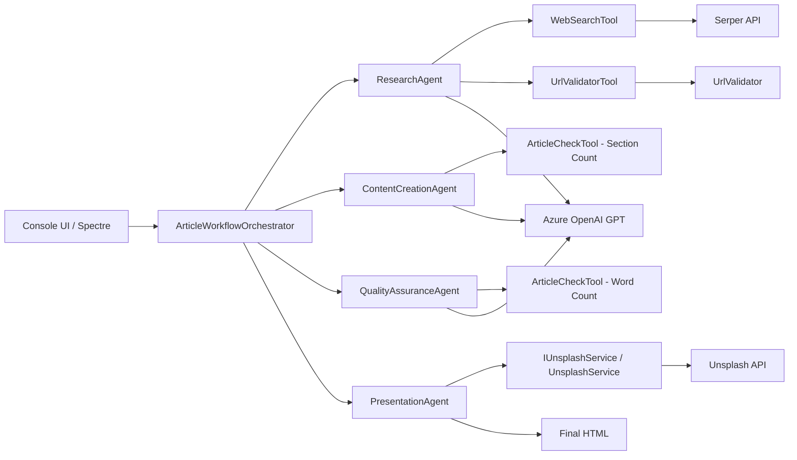
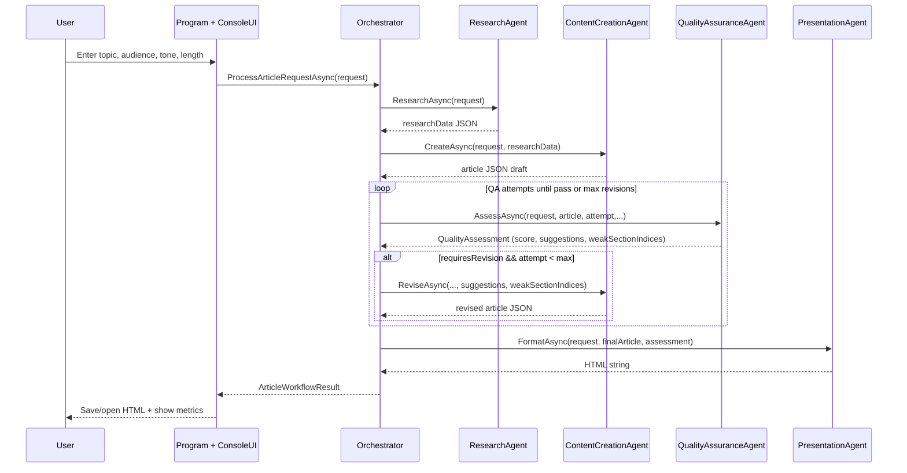
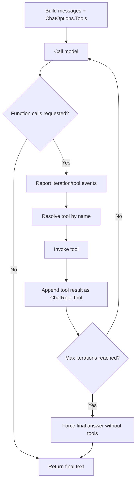

# AI Article Writer - Technical Presentation Guide

## 1. Project Introduction

AI Article Writer is a .NET 8 multi-agent system that takes a topic and audience, researches the web, generates structured long-form content, validates quality, performs targeted revisions, and renders a polished responsive HTML article.

The design goal is to separate concerns into specialized agents while keeping orchestration deterministic and observable.

---

## 2. What You Can Present in a Session

This project is ideal to demonstrate:

1. Agentic architecture in an enterprise-friendly .NET codebase.
2. Tool-use loops with explicit function calling.
3. Quality gating with revision control.
4. Performance optimization through parallel search and targeted revisions.
5. Deterministic rendering layer (no AI hallucination in final HTML generation).

---

## 3. System Architecture (High-Level)



---

## 4. End-to-End Workflow

### 4.1 Runtime Sequence



### 4.2 Orchestration Decisions

- The orchestrator never overrides QA revision authority.
- Revision count tracks real revision cycles, not loop iterations.
- Progress and agent conversation logs are captured for live session visibility.

Reference: `Agents/ArticleWorkflowOrchestrator.cs`

```csharp
// QA agent is the authority — if it says no revision needed, we stop.
if (!finalAssessment.RequiresRevision)
    break;

if (attempt < maxRevisions)
{
    currentContent = await _contentCreationAgent.ReviseAsync(
        request,
        currentContent,
        finalAssessment.Feedback,
        finalAssessment.RevisionSuggestions,
        finalAssessment.WeakSectionIndices,
        cancellationToken);
}
```

---

## 5. Solution Structure

### 5.1 Entry and Composition Root

- `Program.cs`
- `BuildHost(...)` wires all dependencies, config sections, and typed HttpClients.
- Uses Azure OpenAI via API key OR `DefaultAzureCredential`.

Reference: `Program.cs`

```csharp
services.AddSingleton<IChatClient>(_ =>
{
    var azureClient = string.IsNullOrWhiteSpace(apiKey)
        ? new AzureOpenAIClient(new Uri(endpoint), new DefaultAzureCredential())
        : new AzureOpenAIClient(new Uri(endpoint), new AzureKeyCredential(apiKey));

    return azureClient.GetChatClient(deploymentName).AsIChatClient();
});
```

---

## 6. DTOs, Models, and Contracts

This is the core data contract layer (your "DTO" story for presentation).

### 6.1 Request DTO

- `ArticleRequest` captures topic, audience, length tier, tone, and key points.
- `RequiredLength` exposes word target from `ArticleLength` value object.

Reference: `Models/ArticleModels.cs`

```csharp
public record ArticleRequest(
    string Topic,
    string TargetAudience,
    ArticleLength Length,
    string ToneOfVoice,
    string[] KeyPoints
)
{
    public int RequiredLength => Length.ApproximateWords;
}
```

### 6.2 Quality DTO

- `QualityAssessment` includes criterion scores, decision flag, revision suggestions.
- `WeakSectionIndices` enables section-targeted revisions.

Reference: `Models/ArticleModels.cs`

```csharp
public record QualityAssessment(
    [property: JsonPropertyName("overallScore")] double OverallScore,
    [property: JsonPropertyName("requiresRevision")] bool RequiresRevision,
    [property: JsonPropertyName("revisionSuggestions")] string[] RevisionSuggestions,
    [property: JsonPropertyName("weakSectionIndices")] int[]? WeakSectionIndices = null
);
```

### 6.3 Workflow Result DTO

- `ArticleWorkflowResult` combines final JSON, rendered HTML, quality stats, and completion metadata.

Reference: `Models/ArticleModels.cs`

```csharp
public record ArticleWorkflowResult(
    ArticleRequest OriginalRequest,
    string FinalContent,
    string FormattedContent,
    QualityAssessment? QualityAssessment,
    double FinalQualityScore,
    int RevisionCount,
    DateTimeOffset CompletedAt
);
```

### 6.4 Agent Interfaces (Contracts)

- `IResearchAgent`, `IContentCreationAgent`, `IQualityAssuranceAgent`, `IPresentationAgent`
- Keeps orchestrator decoupled and testable.

Reference: `Agents/IAgentContracts.cs`

```csharp
public interface IContentCreationAgent
{
    Task<string> CreateAsync(ArticleRequest request, string researchData, CancellationToken cancellationToken = default);

    Task<string> ReviseAsync(
        ArticleRequest request,
        string currentContent,
        string qualityFeedback,
        string[] revisionSuggestions,
        int[]? weakSectionIndices,
        CancellationToken cancellationToken = default);
}
```

---

## 7. Services Layer

### 7.1 Unsplash Service

- `IUnsplashService` abstraction for image resolution.
- Falls back to source.unsplash.com when key is missing or API fails.
- Presentation agent calls it in parallel for header + section images.

Reference: `Services/UnsplashService.cs`

```csharp
public async Task<string> ResolveImageUrlAsync(string query, string size, CancellationToken cancellationToken = default)
{
    if (string.IsNullOrWhiteSpace(_config.AccessKey))
        return BuildFallbackUrl(size, query);

    try
    {
        var apiUrl = _config.BuildApiUrl(size, query);
        using var response = await _http.GetAsync(apiUrl, cancellationToken);
        if (!response.IsSuccessStatusCode)
            return BuildFallbackUrl(size, query);
        ...
    }
    catch
    {
        return BuildFallbackUrl(size, query);
    }
}
```

---

## 8. Tooling Layer

## 8.1 WebSearchTool

- Wraps Serper search API.
- Formats result snippets for LLM consumption.

Reference: `Tools/WebSearchTool.cs`

```csharp
public async Task<string> SearchWebAsync(string query)
{
    var payload = JsonSerializer.Serialize(new { q = query, num = _resultCount });
    using var content = new StringContent(payload, Encoding.UTF8, "application/json");

    var response = await _http.PostAsync("/search", content);
    response.EnsureSuccessStatusCode();

    var json = await response.Content.ReadAsStringAsync();
    return FormatResults(json);
}
```

### 8.2 UrlValidatorTool + UrlValidator

- `UrlValidatorTool` exposes validation as LLM-callable function.
- Uses trusted-domain whitelist to skip unnecessary HEAD calls.
- Falls through to `UrlValidator.IsUrlValidAsync(...)` for real network checks.

Reference: `Tools/UrlValidatorTool.cs`

```csharp
if (Uri.TryCreate(url, UriKind.Absolute, out var parsedUri)
    && TrustedDomains.Contains(parsedUri.Host))
{
    return $"VALID — URL is accessible: {url}";
}

var isValid = await _validator.IsUrlValidAsync(url);
```

Reference: `Utils/UrlValidator.cs`

```csharp
using var request = new HttpRequestMessage(HttpMethod.Head, uri);
request.Headers.Add("User-Agent", "ArticleWriter-UrlValidator/1.0");
using var response = await _httpClient.SendAsync(request, cancellationToken);
return response.IsSuccessStatusCode;
```

### 8.3 ArticleCheckTool

- Deterministic validation tools for QA/content agents.
- Includes control-character sanitation before parsing JSON.

Reference: `Tools/ArticleCheckTool.cs`

```csharp
articleJson = Regex.Replace(articleJson, "[\x00-\x08\x0B\x0C\x0E-\x1F]", "");
using var doc = JsonDocument.Parse(articleJson);
```

---

## 9. Agent Deep Dive

### 9.1 ResearchAgent

Responsibilities:

1. Build query set (overview + key point focused queries).
2. Execute searches in parallel.
3. Synthesize structured research JSON with validated sources.

Performance optimization:

- All search queries are pre-fetched in parallel using `Task.WhenAll`.
- LLM now focuses on synthesis and selective URL validation.

Reference: `Agents/ResearchAgent.cs`

```csharp
var searchTasks = queries.Select(q => _webSearch.SearchWebAsync(q)).ToList();
string[] searchResults = await Task.WhenAll(searchTasks);
```

### 9.2 ContentCreationAgent

Responsibilities:

1. Generate strict JSON article schema.
2. Enforce one-section-per-key-point.
3. Preserve language localization labels.
4. Revise either targeted sections or full article.

Targeted revision flow:

- If QA returns `weakSectionIndices`, only those sections are rewritten.
- Revised section array is merged back into original JSON.
- Fallback to full revision when extraction/parsing fails.

Reference: `Agents/ContentCreationAgent.cs`

```csharp
if (weakSectionIndices is { Length: > 0 })
{
    return await ReviseTargetedSectionsAsync(
        request, currentContent, qualityFeedback,
        revisionSuggestions, weakSectionIndices, cancellationToken);
}

return await ReviseFullArticleAsync(
    request, currentContent, qualityFeedback, revisionSuggestions, cancellationToken);
```

Reference: `Agents/ContentCreationAgent.cs`

```csharp
for (int i = 0; i < targetIndices.Length && i < revisedArray.Count; i++)
    origSections[targetIndices[i]] = revisedArray[i];
```

### 9.3 QualityAssuranceAgent

Responsibilities:

1. Evaluate content using 8 quality criteria.
2. Use tool call (`count_words_async`) for completeness scoring.
3. Decide revision requirement and section-level weaknesses.

Reference: `Agents/QualityAssuranceAgent.cs`

```csharp
var tools = new[] { _articleCheck.CountWordsFunction() };
var response = await CallWithToolsAsync(systemPrompt, userMessage, tools, cancellationToken);
var assessment = JsonSerializer.Deserialize<QualityAssessment>(json)
    ?? throw new InvalidOperationException("Quality assessment returned null after deserialisation");
```

### 9.4 PresentationAgent

Responsibilities:

1. Parse final article JSON.
2. Resolve all images in parallel.
3. Build fully responsive HTML in deterministic C# renderer.

Key design choice:

- No LLM call during rendering. This guarantees every section appears in output and avoids output truncation/hallucinated markup.

Reference: `Agents/PresentationAgent.cs`

```csharp
var headerTask = _unsplash.ResolveImageUrlAsync(headerQuery, headerSize, cancellationToken);
var sectionTasks = sectionQueries
    .Select(sq => _unsplash.ResolveImageUrlAsync(sq.Query, sectionSize, cancellationToken))
    .ToList();

await Task.WhenAll(sectionTasks.Prepend(headerTask));
```

---

## 10. How Agents Call Tools (Mechanics)

The tool loop is centralized in `BaseAgent.CallWithToolsAsync(...)`.

### 10.1 Tool Loop Lifecycle



Reference: `Agents/BaseAgent.cs`

```csharp
var functionCalls = response.Messages
    .SelectMany(m => m.Contents)
    .OfType<FunctionCallContent>()
    .ToList();

foreach (var call in functionCalls)
{
    var fn = tools.FirstOrDefault(t =>
        string.Equals(t.Name, call.Name, StringComparison.OrdinalIgnoreCase));
    ...
    messages.Add(new ChatMessage(ChatRole.Tool,
        [new FunctionResultContent(call.CallId, resultText)]));
}
```

### 10.2 Tool Telemetry for Live Demos

- `IToolCallReporter` provides iteration/call/result/max-iteration hooks.
- `ConsoleToolCallReporter` prints concise trace lines with thread safety.

Reference: `Agents/IToolCallReporter.cs`

```csharp
void ReportIteration(string agentName, int iteration, int callCount);
void ReportToolCall(string agentName, string toolName, string argsJson);
void ReportToolResult(string agentName, string toolName, string result, bool isError = false);
void ReportMaxIterationsReached(string agentName, int max);
```

Reference: `Presentation/ConsoleToolCallReporter.cs`

```csharp
AnsiConsole.MarkupLine(
    $"  [dim][[{agentName.EscapeMarkup()}]][/] " +
    $"[deepskyblue1]→ {toolName.EscapeMarkup()}[/] " +
    $"[grey]{args.EscapeMarkup()}[/]");
```

---

## 11. Configuration and Runtime Controls

### 11.1 Key Config Areas

- `AzureOpenAI` - endpoint, key/credential mode, deployment name.
- `ArticleGeneration` - quality threshold and max revisions.
- `Serper` - API key and result count.
- `Images` - access key and image sizes.

Reference: `appsettings.json`

```json
"ArticleGeneration": {
  "QualityThreshold": 85,
  "MaxRevisions": 2
}
```

### 11.2 Why These Matter in a Presentation

- Show how product owners can tune quality and cost/latency without code changes.
- Explain threshold conversion from 0-100 to 0-10 scoring in QA logic.

---

## 12. Resilience and Failure Handling

### 12.1 Retry and Backoff

- Handles 429/500/502/503.
- Honors `retry-after` when available.
- Uses exponential backoff fallback.

Reference: `Agents/BaseAgent.cs`

```csharp
catch (Azure.RequestFailedException ex)
    when (TransientStatusCodes.Contains(ex.Status) && attempt < maxAttempts)
{
    var delay = ResolveRetryDelay(ex, attempt);
    await Task.Delay(delay, cancellationToken);
}
```

### 12.2 Safe Exception Output

- Program uses fallback plain-text error write in case Spectre exception formatting fails.

Reference: `Program.cs`

```csharp
try { AnsiConsole.WriteException(ex, ExceptionFormats.ShortenEverything); }
catch { Console.Error.WriteLine($"[ERROR] {ex.GetType().Name}: {ex.Message}"); }
```

---

## 13. Performance Story (Great for Demo)

### 13.1 Implemented Optimizations

1. Parallel web search fan-out in `ResearchAgent`.
2. Trusted-domain URL validation short-circuit.
3. Targeted section revisions instead of full rewrite.
4. Parallel image resolution in `PresentationAgent`.
5. Max revision cap tuned to 2 by config.

### 13.2 Impact Narrative

- Reduced multi-round-trip latency in research phase.
- Reduced token-heavy rewrite cycles by operating only on weak sections.
- Preserved quality gate while improving throughput.

---

## 14. Suggested Session Walkthrough (Step-by-Step)

1. Explain business problem: quality long-form content is slow and inconsistent.
2. Introduce 4-agent architecture and why separation of concerns matters.
3. Show orchestrator workflow diagram and sequence.
4. Show tool-call mechanism in `BaseAgent`.
5. Demo one run from console input to generated HTML.
6. Open generated HTML and point out localized labels, TOC, references, visuals.
7. Show QA decision + revision behavior from terminal logs.
8. Explain optimizations (parallel search + targeted revision).
9. Close with extensibility roadmap.

---

## 15. Extensibility Roadmap (Talking Points)

1. Add citation confidence scoring and source freshness weighting.
2. Add language-specific readability metrics in QA.
3. Plug in alternate renderers (Markdown/PDF) via additional presentation agents.
4. Add persistent run history and analytics dashboard.
5. Add integration tests around synthetic tool responses.

---

## 16. Quick Demo Checklist

- `appsettings.Development.json` contains valid keys.
- `dotnet run` starts and asks for article parameters.
- Confirm tool call traces appear in console.
- Confirm QA scoring appears.
- Save and open generated HTML.
- Verify labels are localized and references are linked.

---

## 17. File Reference Index

- `Program.cs`
- `Agents/BaseAgent.cs`
- `Agents/ArticleWorkflowOrchestrator.cs`
- `Agents/ResearchAgent.cs`
- `Agents/ContentCreationAgent.cs`
- `Agents/QualityAssuranceAgent.cs`
- `Agents/PresentationAgent.cs`
- `Agents/IAgentContracts.cs`
- `Agents/IToolCallReporter.cs`
- `Presentation/ConsoleToolCallReporter.cs`
- `Tools/WebSearchTool.cs`
- `Tools/UrlValidatorTool.cs`
- `Tools/ArticleCheckTool.cs`
- `Utils/UrlValidator.cs`
- `Services/UnsplashService.cs`
- `Models/ArticleModels.cs`
- `appsettings.json`
