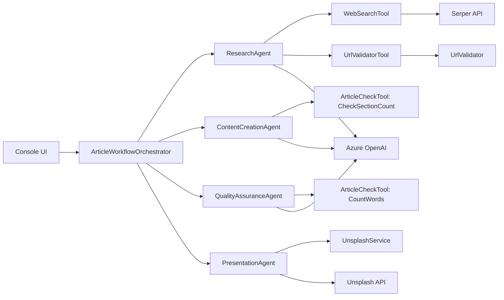
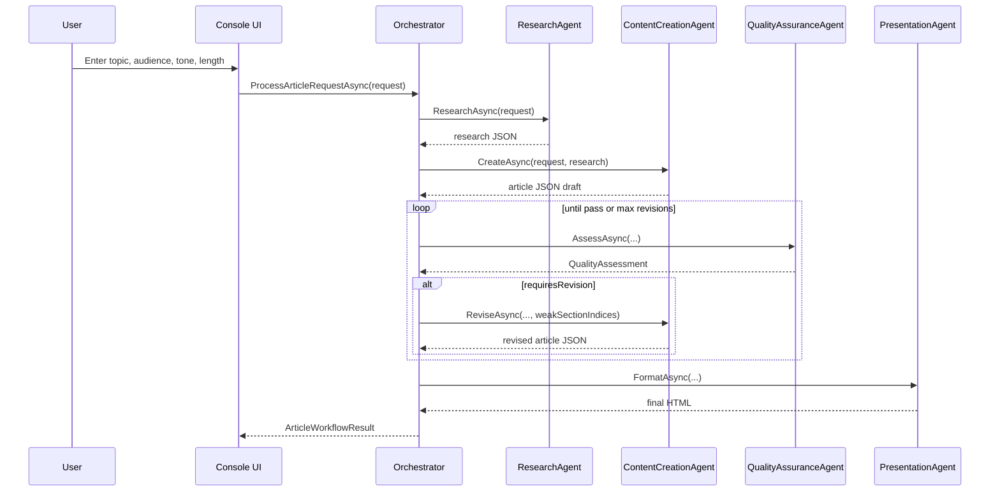

# AI Article Writer - Technical Guide

## Document Purpose

This guide explains how the AI Article Writer system works from an engineering perspective.
It is written for developers, architects, and technical stakeholders who need to understand:

1. System architecture
2. Data contracts (DTOs/models)
3. Agents and tools
4. Runtime flow and quality loop
5. Extensibility and operational behavior

## Who Should Read This

- Developers onboarding to the codebase
- Engineers preparing demos or technical presentations
- Architects reviewing system decomposition and reliability
- QA/DevOps teams validating behavior and troubleshooting flows

---

## 1. System Overview

AI Article Writer is a .NET 8 multi-agent pipeline that turns a user prompt into a fully rendered HTML article.

Core stages:

1. Research
2. Content generation
3. Quality assurance and revision
4. Presentation rendering

The orchestration logic is deterministic; the language model is used where generation or judgment is needed, while final rendering is done in C# for predictable output.

Reference: `Program.cs`

```csharp
var orchestrator = host.Services.GetRequiredService<ArticleWorkflowOrchestrator>();
var request = await ConsoleUI.CollectArticleRequestAsync(host.Services, config);
var result = await ExecuteWithProgressAsync(orchestrator, request);
ConsoleUI.DisplayResults(result);
```

---

## 2. High-Level Architecture

### 2.1 Diagram (Mermaid)


---

## 3. End-to-End Runtime Flow

### 3.1 Sequence Diagram (Mermaid)



### 3.2 Sequence (Plain Steps)

1. User provides request in console UI.
2. Orchestrator triggers `ResearchAgent`.
3. Research data is passed to `ContentCreationAgent`.
4. QA scores output and decides whether revision is needed.
5. If needed, content is revised (targeted sections when available).
6. `PresentationAgent` produces final HTML with images and localization labels.
7. Result is displayed and optionally saved to file.

Reference: `Agents/ArticleWorkflowOrchestrator.cs`

```csharp
var researchData = await _researchAgent.ResearchAsync(request, cancellationToken);
var currentContent = await _contentCreationAgent.CreateAsync(request, researchData, cancellationToken);
finalAssessment = await _qaAgent.AssessAsync(request, currentContent, attempt, maxRevisions, _config.QualityThreshold, cancellationToken);
var formattedContent = await _presentationAgent.FormatAsync(request, currentContent, finalAssessment, cancellationToken);
```

---

## 4. Composition Root and Dependency Injection

The application is composed through DI in `Program.cs`.

### 4.1 Important Registrations

- `IChatClient` backed by Azure OpenAI
- Typed `HttpClient` for URL validation, Serper, Unsplash
- Agent interfaces and orchestrator
- Tool call reporter for runtime telemetry

Reference: `Program.cs`

```csharp
services.AddSingleton<IResearchAgent, ResearchAgent>();
services.AddSingleton<IContentCreationAgent, ContentCreationAgent>();
services.AddSingleton<IQualityAssuranceAgent, QualityAssuranceAgent>();
services.AddSingleton<IPresentationAgent, PresentationAgent>();
services.AddSingleton<ArticleWorkflowOrchestrator>();
```

---

## 5. Data Contracts (DTOs and Models)

### 5.1 Request Model

Reference: `Models/ArticleModels.cs`

```csharp
public record ArticleRequest(
    string Topic,
    string TargetAudience,
    ArticleLength Length,
    string ToneOfVoice,
    string[] KeyPoints
)
{
    public int RequiredLength => Length.ApproximateWords;
}
```

### 5.2 Quality Model

Reference: `Models/ArticleModels.cs`

```csharp
public record QualityAssessment(
    [property: JsonPropertyName("overallScore")] double OverallScore,
    [property: JsonPropertyName("requiresRevision")] bool RequiresRevision,
    [property: JsonPropertyName("revisionSuggestions")] string[] RevisionSuggestions,
    [property: JsonPropertyName("weakSectionIndices")] int[]? WeakSectionIndices = null
);
```

### 5.3 Result Model

Reference: `Models/ArticleModels.cs`

```csharp
public record ArticleWorkflowResult(
    ArticleRequest OriginalRequest,
    string FinalContent,
    string FormattedContent,
    QualityAssessment? QualityAssessment,
    double FinalQualityScore,
    int RevisionCount,
    DateTimeOffset CompletedAt
);
```

---

## 6. Agent Contracts

Interfaces define clear responsibilities and keep orchestration testable.

Reference: `Agents/IAgentContracts.cs`

```csharp
public interface IContentCreationAgent
{
    Task<string> CreateAsync(ArticleRequest request, string researchData, CancellationToken cancellationToken = default);
    Task<string> ReviseAsync(
        ArticleRequest request,
        string currentContent,
        string qualityFeedback,
        string[] revisionSuggestions,
        int[]? weakSectionIndices,
        CancellationToken cancellationToken = default);
}
```

---

## 7. Base Agent Runtime: Tool Loop and Retries

All agents derive from `BaseAgent`, which centralizes:

1. LLM invocation with settings (`Temperature`, `MaxOutputTokens`)
2. Tool-calling loop (`CallWithToolsAsync`)
3. Retry/backoff for transient failures
4. Tool call reporting hooks

Reference: `Agents/BaseAgent.cs`

```csharp
var functionCalls = response.Messages
    .SelectMany(m => m.Contents)
    .OfType<FunctionCallContent>()
    .ToList();

if (functionCalls.Count == 0)
    return response.Text ?? string.Empty;
```

Reference: `Agents/BaseAgent.cs`

```csharp
catch (Azure.RequestFailedException ex)
    when (TransientStatusCodes.Contains(ex.Status) && attempt < maxAttempts)
{
    var delay = ResolveRetryDelay(ex, attempt);
    await Task.Delay(delay, cancellationToken);
}
```

---

## 8. Agents Deep Dive

## 8.1 ResearchAgent

Responsibilities:

1. Build broad + key-point search queries
2. Execute searches in parallel
3. Synthesize structured research payload
4. Validate candidate URLs through tool call

Reference: `Agents/ResearchAgent.cs`

```csharp
var searchTasks = queries
    .Select(q => _webSearch.SearchWebAsync(q))
    .ToList();

string[] searchResults = await Task.WhenAll(searchTasks);
```

## 8.2 ContentCreationAgent

Responsibilities:

1. Generate strict JSON article schema
2. Ensure one section per key point
3. Preserve localization labels in JSON
4. Support targeted section revision

Reference: `Agents/ContentCreationAgent.cs`

```csharp
if (weakSectionIndices is { Length: > 0 })
{
    return await ReviseTargetedSectionsAsync(
        request, currentContent, qualityFeedback,
        revisionSuggestions, weakSectionIndices, cancellationToken);
}
```

## 8.3 QualityAssuranceAgent

Responsibilities:

1. Score quality dimensions
2. Request word-count tool signal
3. Return revision suggestions and weak section indices

Reference: `Agents/QualityAssuranceAgent.cs`

```csharp
var tools = new[] { _articleCheck.CountWordsFunction() };
var response = await CallWithToolsAsync(systemPrompt, userMessage, tools, cancellationToken);
```

## 8.4 PresentationAgent

Responsibilities:

1. Parse article JSON
2. Resolve images in parallel
3. Render deterministic responsive HTML

Reference: `Agents/PresentationAgent.cs`

```csharp
var headerTask = _unsplash.ResolveImageUrlAsync(headerQuery, headerSize, cancellationToken);
var sectionTasks = sectionQueries
    .Select(sq => _unsplash.ResolveImageUrlAsync(sq.Query, sectionSize, cancellationToken))
    .ToList();

await Task.WhenAll(sectionTasks.Prepend(headerTask));
```

---

## 9. Tools and Services

## 9.1 WebSearchTool

Reference: `Tools/WebSearchTool.cs`

```csharp
var payload = JsonSerializer.Serialize(new { q = query, num = _resultCount });
using var content = new StringContent(payload, Encoding.UTF8, "application/json");
var response = await _http.PostAsync("/search", content);
```

## 9.2 UrlValidatorTool

Reference: `Tools/UrlValidatorTool.cs`

```csharp
if (Uri.TryCreate(url, UriKind.Absolute, out var parsedUri)
    && TrustedDomains.Contains(parsedUri.Host))
{
    return $"VALID — URL is accessible: {url}";
}
```

## 9.3 ArticleCheckTool

Reference: `Tools/ArticleCheckTool.cs`

```csharp
articleJson = Regex.Replace(articleJson, "[\x00-\x08\x0B\x0C\x0E-\x1F]", "");
using var doc = JsonDocument.Parse(articleJson);
```

## 9.4 UnsplashService

Reference: `Services/UnsplashService.cs`

```csharp
if (string.IsNullOrWhiteSpace(_config.AccessKey))
    return BuildFallbackUrl(size, query);
```

---

## 10. Tool Call Observability

The tool call trace shown in console is implemented through `IToolCallReporter`.

Reference: `Agents/IToolCallReporter.cs`

```csharp
void ReportIteration(string agentName, int iteration, int callCount);
void ReportToolCall(string agentName, string toolName, string argsJson);
void ReportToolResult(string agentName, string toolName, string result, bool isError = false);
```

Reference: `Presentation/ConsoleToolCallReporter.cs`

```csharp
AnsiConsole.MarkupLine(
    $"  [dim][[{agentName.EscapeMarkup()}]][/] " +
    $"[deepskyblue1]→ {toolName.EscapeMarkup()}[/] " +
    $"[grey]{args.EscapeMarkup()}[/]");
```

---

## 11. Configuration Reference

Key sections in `appsettings.json`:

1. `AzureOpenAI`
2. `ArticleGeneration`
3. `Images`
4. `Serper`

Reference: `appsettings.json`

```json
"ArticleGeneration": {
  "QualityThreshold": 85,
  "MaxRevisions": 2
}
```

---

## 12. Operational and Reliability Notes

1. Retry logic handles transient cloud/API failures.
2. URL validation helps prevent dead-source citations.
3. JSON sanitation in `ArticleCheckTool` avoids parse failures from control characters.
4. Presentation rendering in C# avoids model truncation in final output phase.

Reference: `Program.cs`

```csharp
try { AnsiConsole.WriteException(ex, ExceptionFormats.ShortenEverything); }
catch { Console.Error.WriteLine($"[ERROR] {ex.GetType().Name}: {ex.Message}"); }
```

---

## 13. Demo Script (Technical Session)

1. Start with architecture overview diagram.
2. Show orchestrator flow and QA authority rule.
3. Demonstrate live tool call trace in console.
4. Run end-to-end generation.
5. Open generated HTML and point out localized labels, TOC, references, and images.
6. Explain performance improvements: parallel search, targeted revisions, and parallel image fetch.

---

## 14. Troubleshooting Mermaid Charts

If charts look like code blocks:

1. Open Markdown Preview in VS Code (`Ctrl+Shift+V`).
2. Ensure Mermaid support is enabled in your Markdown preview extension.
3. Use the ASCII fallback diagrams in this document when preview plugins are unavailable.

---

## 15. Source File Index

- `Program.cs`
- `Agents/BaseAgent.cs`
- `Agents/ArticleWorkflowOrchestrator.cs`
- `Agents/ResearchAgent.cs`
- `Agents/ContentCreationAgent.cs`
- `Agents/QualityAssuranceAgent.cs`
- `Agents/PresentationAgent.cs`
- `Agents/IAgentContracts.cs`
- `Agents/IToolCallReporter.cs`
- `Presentation/ConsoleToolCallReporter.cs`
- `Tools/WebSearchTool.cs`
- `Tools/UrlValidatorTool.cs`
- `Tools/ArticleCheckTool.cs`
- `Utils/UrlValidator.cs`
- `Services/UnsplashService.cs`
- `Models/ArticleModels.cs`
- `appsettings.json`
